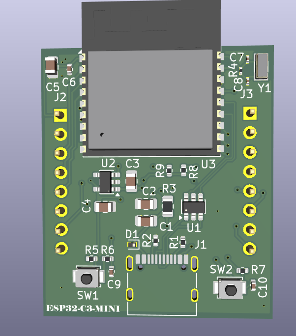
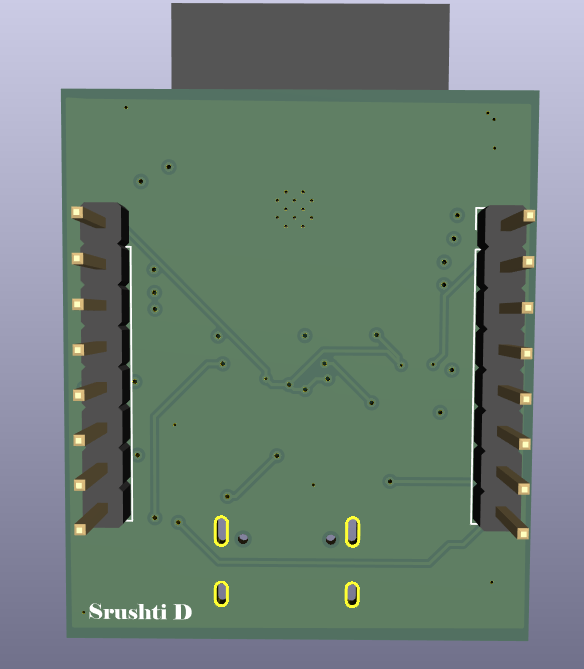
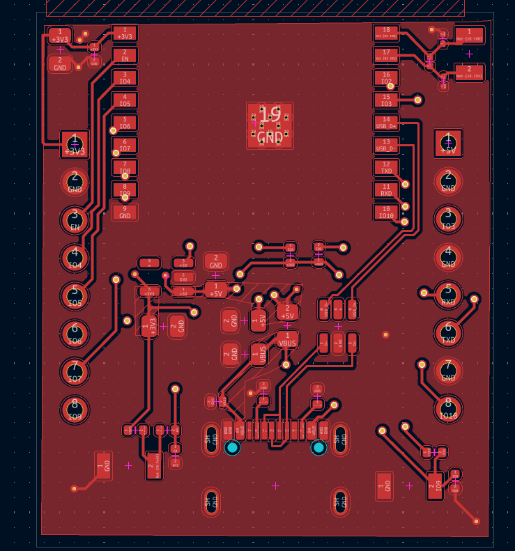
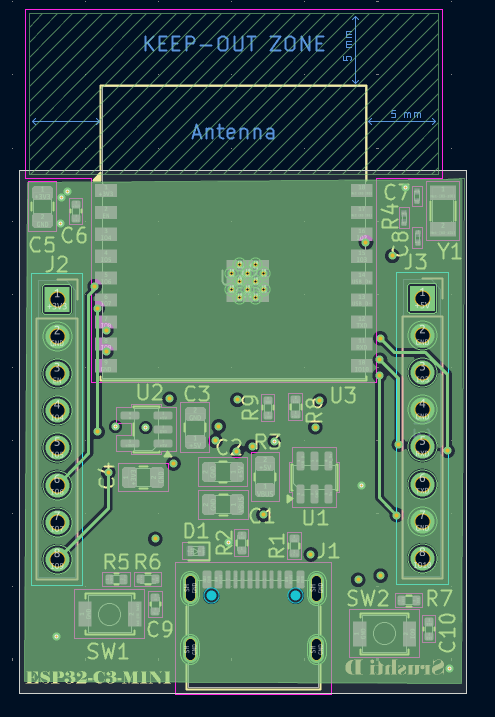
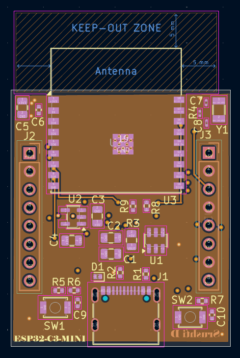
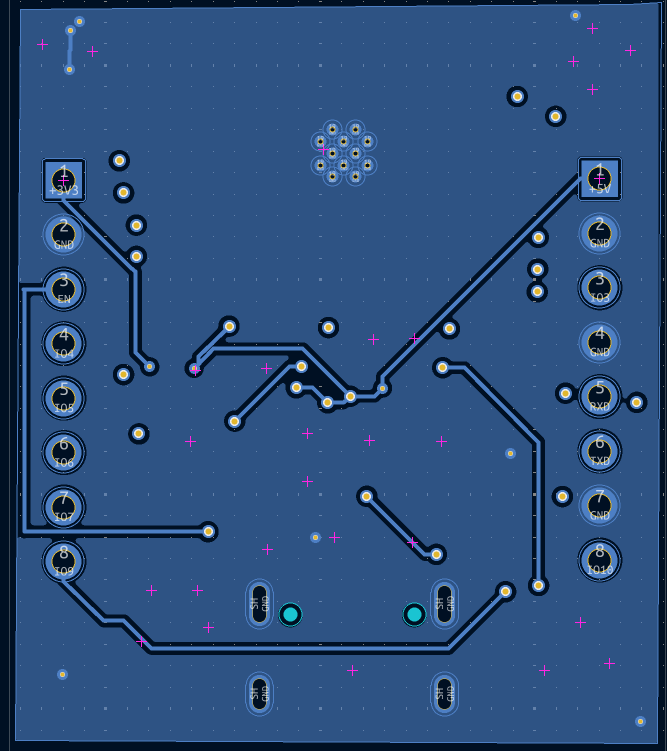

# ESP32-C3-WROOM-02 Development Board

A custom 4-layer development board built around the ESP32-C3-WROOM-02 module, designed from schematic to PCB using KiCad 10.

The board provides USB-C power and data connectivity, 3.3 V regulation, boot/reset controls, GPIO expansion, USB ESD protection, and an antenna keep-out region.

---
## Overview

This project focuses on the complete hardware design of a compact ESP32-C3 development board, covering the process from schematic design and component selection to multi-layer PCB layout and design-rule validation.

The board integrates:

- ESP32-C3-WROOM-02 module
- USB-C power and data interface
- 3.3 V regulated power supply
- USB ESD protection
- Boot and Reset buttons
- GPIO expansion headers
- External crystal oscillator
- Power filtering and decoupling
- 4-layer PCB
- Dedicated ESP32 antenna keep-out region

The schematic and PCB were designed using **KiCad 10**.

---
## Features

- ESP32-C3-WROOM-02 module
- USB-C power and USB data interface
- USB-UART interface
- 3.3 V LDO power supply
- USB ESD protection
- Boot and Reset buttons
- GPIO expansion headers
- External crystal oscillator
- Power supply filtering and decoupling
- 4-layer PCB
- Custom component placement and routing
- ESP32 antenna keep-out region
- DRC validated with 0 errors and 0 unconnected items

---
## Software Used

- **KiCad 10**

---
## Hardware Architecture

The design is divided into several functional blocks.

### Input Power & USB-C

The USB-C interface provides both power input and USB data connectivity.

Components include:

- USB-C receptacle
- USB power input
- USB D+ and D− data lines
- USB ESD protection
- CC resistors
- Power filtering capacitors

### 3.3 V Power Supply

The ESP32-C3 operates from a 3.3 V supply generated using an AP2112K-3.3 LDO.

Components include:

- AP2112K-3.3 LDO
- Input capacitor
- Output capacitor
- 3.3 V power rail

### ESP32-C3-WROOM-02

The main module provides the processing and wireless functionality of the board.

The design includes:

- ESP32-C3-WROOM-02
- Decoupling capacitors
- External crystal
- EN connection
- GPIO connections
- USB/UART connections
- Antenna keep-out region

### Boot & Reset

Dedicated push buttons are provided for:

- Boot mode selection
- Reset control

Pull-up resistors and RC components are used for the required control signals.

### GPIO Expansion

Two pin headers provide access to selected ESP32-C3 GPIO pins along with power and ground connections.

---
## Schematic

The schematic was designed in KiCad 10 and organized into functional blocks for power, USB-C, ESP32-C3, boot/reset, GPIO expansion, clock, and decoupling circuitry.

---
## PCB Design

The board uses a **4-layer PCB stackup** to provide additional routing flexibility and internal copper layers.

### PCB Stackup

| Physical Layer | KiCad Layer | Description |
|---|---|---|
| Layer 1 | F.Cu | Top copper |
| Layer 2 | In1.Cu | Inner copper layer 1 |
| Layer 3 | In2.Cu | Inner copper layer 2 |
| Layer 4 | B.Cu | Bottom copper |

---
## Schematic

The schematic was designed in KiCad 10 and organized into functional blocks for power, USB-C, ESP32-C3, boot/reset, GPIO expansion, clock, and decoupling circuitry.

---

## PCB Design

The board uses a **4-layer PCB stackup** to provide additional routing flexibility and internal copper layers.

### PCB Stackup

| Physical Layer | KiCad Layer | Description |
|---|---|---|
| Layer 1 | F.Cu | Top copper |
| Layer 2 | In1.Cu | Inner copper layer 1 |
| Layer 3 | In2.Cu | Inner copper layer 2 |
| Layer 4 | B.Cu | Bottom copper |

---
## 3D Views

### Front View

The front 3D view showing the ESP32-C3-WROOM-02 module, USB-C interface, GPIO headers, buttons, and other components.

### Back View

The back 3D view showing the bottom side of the PCB and its components/routing.

---
## Copper Layer Layout

### Front Copper — F.Cu

The top copper layer showing component-side routing and copper distribution.

### Inner Copper Layer 1 — In1.Cu

The first internal copper layer of the 4-layer PCB, showing the copper distribution and routing on `In1.Cu`.

### Inner Copper Layer 2 — In2.Cu

The second internal copper layer of the 4-layer PCB, showing the copper distribution and routing on `In2.Cu`.

### Back Copper — B.Cu

The bottom copper layer showing the bottom-side routing and copper distribution.

---
## Antenna Keep-Out

A dedicated keep-out region is maintained around the ESP32-C3-WROOM-02 antenna.

The antenna area is kept clear of copper and other conductive structures to maintain the required clearance around the RF antenna region.---
## PCB Specifications

| Parameter | Value |
|---|---|
| PCB Layers | 4 |
| Board Size | ~30.58 × 35.83 mm |
| PCB Thickness | 1.0 mm |
| Design Tool | KiCad 10 |
| Main Module | ESP32-C3-WROOM-02 |
| Logic Voltage | 3.3 V |
| USB Interface | USB-C |
| Power Regulator | AP2112K-3.3 |

---
## Main Components

- ESP32-C3-WROOM-02
- AP2112K-3.3 LDO
- USB-C connector
- USB-UART interface
- USBLC6-2SC6 USB ESD protection
- PESD5V0L1UL ESD protection diode
- Crystal oscillator
- Boot and Reset push buttons
- GPIO headers
- Decoupling and filtering capacitors
- Pull-up and configuration resistors

---
## Design Considerations

### 4-Layer PCB

A 4-layer PCB was selected to provide additional routing flexibility and allow the use of internal copper layers for power, ground, and signal distribution as required by the design.

### USB Protection

ESD protection components are included on the USB interface to help protect the USB data lines from electrostatic discharge.

### Power Decoupling

Decoupling and filtering capacitors are placed around the power circuitry and ESP32-C3 module to support stable operation of the 3.3 V supply.

### Antenna Keep-Out

A dedicated copper keep-out region is provided around the ESP32-C3-WROOM-02 antenna area.

The keep-out extends around the antenna region to maintain clearance from surrounding copper and conductive structures.

### Component Placement

Component placement was carried out with consideration for:

- Short power connections
- Decoupling capacitor placement
- USB signal routing
- GPIO accessibility
- Antenna clearance
- Board compactness

---
## Design Validation

The completed PCB was checked using KiCad's Design Rules Checker (DRC).

- **DRC errors:** 0
- **Unconnected items:** 0

The design was reviewed for routing connectivity and PCB design-rule compliance.

---
## Learning Outcomes

This project provided hands-on experience with:

- 4-layer PCB design
- PCB stackup planning
- Schematic design
- Functional block partitioning
- ESP32-C3 hardware design
- USB-C power and data interface design
- USB ESD protection
- 3.3 V power regulation
- Power filtering and decoupling
- RF antenna keep-out considerations
- Component placement
- Multi-layer PCB routing
- KiCad DRC and design validation
- Preparing a PCB design for fabrication

---
## Future Improvements

Possible future improvements include:

- Add automatic Boot/Reset circuitry for easier programming
- Add power and status indicator LEDs
- Add a battery charging circuit
- Explore a smaller board footprint
- Add additional peripheral interfaces
- Add mounting holes
- Further optimize the PCB layout for compactness

---
## License

This project is licensed under the MIT License — see the [LICENSE](https://claude.ai/chat/LICENSE) file for details.

---
## Author

**Srushti D Hebbar** [GitHub](https://github.com/Srushti-D-Hebbar)
